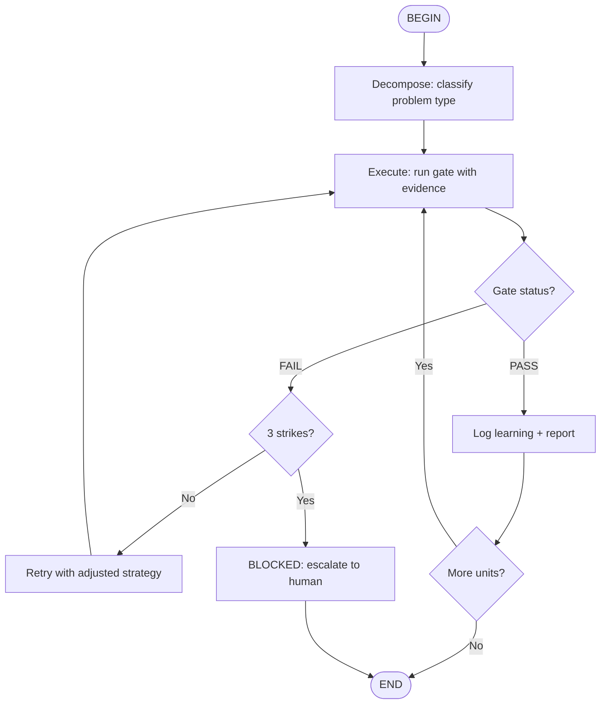

```mermaid
flowchart TD
    A([BEGIN]) --> B[Decompose: classify problem type]
    B --> C[Execute: run gate with evidence]
    C --> D{Gate status?}
    D -->|PASS| E[Log learning + report]
    D -->|FAIL| F{3 strikes?}
    F -->|No| G[Retry with adjusted strategy]
    G --> C
    F -->|Yes| H[BLOCKED: escalate to human]
    E --> I{More units?}
    I -->|Yes| C
    I -->|No| J([END])
    H --> J
```
